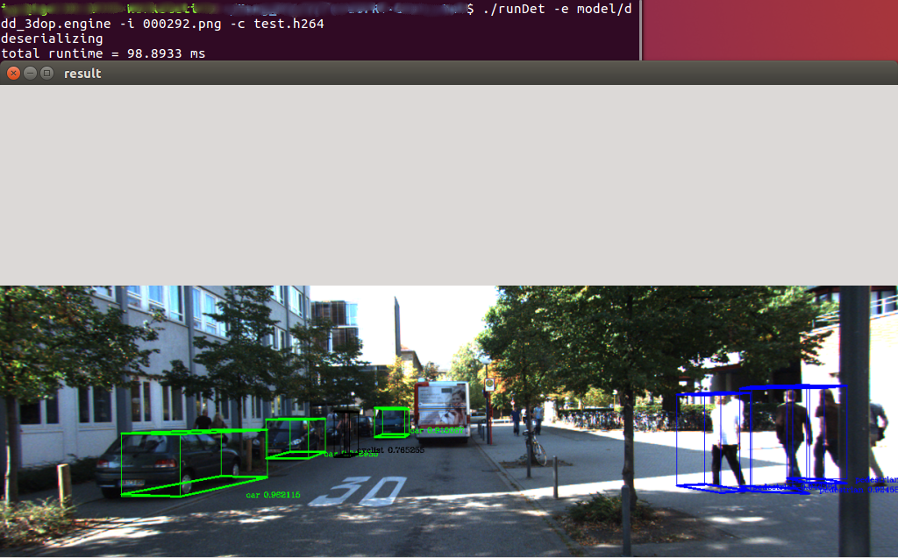
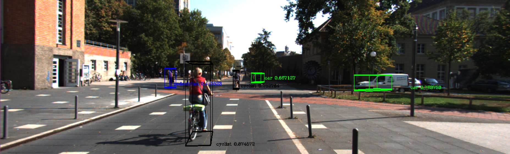
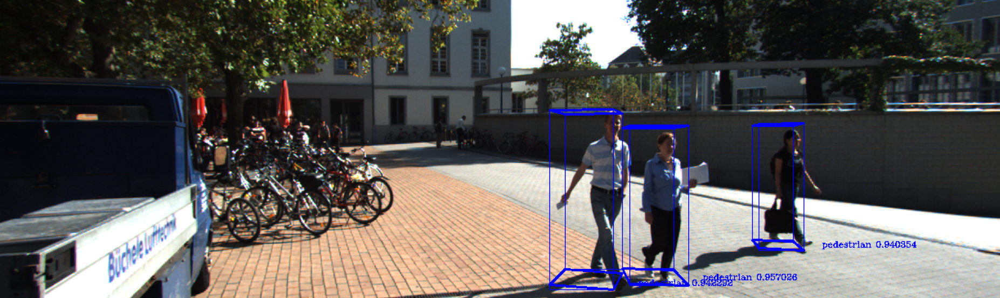

# TensorRT-CenterNet-3D   
Most parts of this Repo are based on [CaoWGG](https://github.com/CaoWGG/TensorRT-CenterNet), Thanks for that great work, and I didn't find an open-sourced 3d-detection based on CenterNet (2020.06). So I followed the work of Cao and test the 3D detection based on CenterNet with the acceleration of TensorRT.
### 1. Enviroments
NVIDIA Quadro M4000
```
pytorch 1.1
ubuntu 16.04
TensorRT 5.0
onnx-tensorrt v5.0
cuda 10.1
```

### 2. Performance

  



### 3. How to use
- download the `ddd_3dop.pth` from [here](https://github.com/xingyizhou/CenterNet/blob/master/readme/MODEL_ZOO.md)
- Convert CenterNet-3D model to `onnx`. See [here](readme/ctddd2onnx.md) for details, Use [netron](https://github.com/lutzroeder/netron) to observe whether the output of the converted onnx model is `(('hm', 3), ('dep', 1), ('rot', 8), ('dim', 3), ('wh', 2), ('reg', 2))`  
- set the OPENCV path in `./src/CMakeLists.txt` ,set the TENSORRT path in `./CMakeLists.txt`
- uncomment the configs of 3-D model in `./include/ctdetConfig.h` and comment others.
- build
```
git clone https://github.com/Qjizhi/TensorRT-CenterNet-3D.git
cd TensorRT-CenterNet-3D
mkdir build
cd build && cmake .. && make
cd ..
```
- build the engie and do the  inference
```
./buildEngine -i model/ddd_3dop.onnx -o model/ddd_3dop.engine
./runDet -e model/ddd_3dop.engine -i 000292.png -c test.h264
```


#### 4. Good to know
- [x] This codes are just for testing and will not be well maintained, for any suggestions and improvements, please propose an issue.
- [x] With the help of TensorRT, the inference time has been shortened from **0.227s** to **98.89ms**.
- [x] The functions of previous Repo are still remained, for exmaple, centerface...


### Related projects
* [TensorRT-CenterNet](https://github.com/CaoWGG/TensorRT-CenterNet)
* [TensorRT-Yolov3](https://github.com/lewes6369/TensorRT-Yolov3)
* [onnx-tensorrt](https://github.com/onnx/onnx-tensorrt)
* [TensorRT](https://github.com/NVIDIA/TensorRT)
* [CenterNet](https://github.com/xingyizhou/centernet)
* [centerface](https://github.com/Star-Clouds/centerface)
* [netron](https://github.com/lutzroeder/netron)
* [cpp-optparse](https://github.com/weisslj/cpp-optparse)
